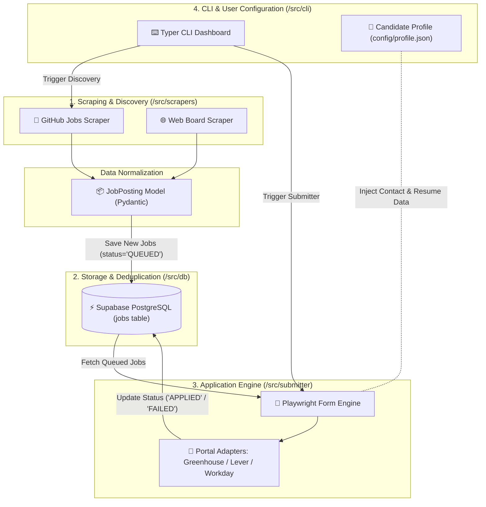

# 🚀 Job Automation Pipeline — Streamlined System Architecture & Collaboration Blueprint

This document defines the technical architecture, agentic design patterns, step-by-step roadmap, and peer collaboration model for building the automated job search, scraping, application submission, and tracking pipeline.

---

## 🏗️ 1. High-Level System Architecture

### Visual ASCII Box Diagram (Plain Text View)

```text
┌─────────────────────────────────────────────────────────────────────────────────┐
│                    4. CLI & USER CONFIGURATION (src/cli)                        │
│     [⌨️ Typer CLI Dashboard]                 [👤 Candidate Profile (profile.json)]│
└───────────┬───────────────────────────────────────────────────┬─────────────────┘
            │ (Trigger Discovery)                               │ (Inject Profile Data)
            ▼                                                   │
┌──────────────────────────────────────┐                        │
│      1. SCRAPING & DISCOVERY         │                        │
│ [🐙 GitHub Scraper] [🌐 Web Scraper] │                        │
└───────────────────┬──────────────────┘                        │
                    │                                           │
                    ▼                                           │
┌──────────────────────────────────────┐                        │
│   [📦 JobPosting Model (Pydantic)]   │                        │
└───────────────────┬──────────────────┘                        │
                    │ (Save New Jobs: status='QUEUED')          │
                    ▼                                           │
┌──────────────────────────────────────────────────────┐        │
│             2. STORAGE & DEDUPLICATION               │        │
│          [⚡ Supabase PostgreSQL Database]            │        │
└───────────────────┬──────────────────────────────────┘        │
                    │ (Fetch Queued Jobs)                       │
                    ▼                                           ▼
┌─────────────────────────────────────────────────────────────────────────────────┐
│                    3. APPLICATION ENGINE (src/submitter)                        │
│     [🤖 Playwright Form Engine] ──► [🔌 Adapters: Greenhouse / Lever / Workday]  │
│                                                                                 │
│     (Submits Application / Dry-Run & Updates Result back to Supabase)           │
└─────────────────────────────────────────────────────────────────────────────────┘
```

---

### Interactive Mermaid Diagram (GitHub / Markdown Preview)



---

## 📦 2. Module Specifications & Directory Layout

```text
job-automation/
├── .env.example
├── .gitignore
├── GEMINI.md
├── README.md
├── docs/
│   └── ARCHITECTURE.md         # Full technical architecture & roadmap
├── config/
│   ├── profile.json            # User contact, education, experience, URLs (git-ignored)
│   └── profile.json.example    # Public sample profile format
├── src/
│   ├── db/                     # Module 1: Supabase client & database handlers
│   │   ├── client.py           # Supabase singleton instance
│   │   ├── models.py           # Pydantic schemas (JobPosting, ApplicationResult)
│   │   └── repository.py       # DB CRUD functions (upsert_job, update_status)
│   ├── scrapers/               # Module 2: Job discovery source adapters
│   │   ├── base.py             # Abstract BaseScraper class
│   │   ├── github_jobs.py      # Scrapes markdown job lists from GitHub repos
│   │   └── web_board.py        # Generic web scraper
│   ├── submitter/              # Module 3: Browser automation engine
│   │   ├── browser.py          # Playwright browser manager (headless/headful)
│   │   ├── form_filler.py      # Field mapper & input interaction engine
│   │   └── strategies/         # Site-specific portal strategies
│   │       ├── base_strategy.py
│   │       ├── greenhouse.py
│   │       ├── lever.py
│   │       └── workday.py
│   └── cli/                    # Module 4: Command Line Interface
│       └── main.py             # Typer CLI commands (scrape, apply, status)
└── tests/                      # Unit & integration tests
```

---

## 🤖 3. Agentic Workflow Design

The core submission loop relies on a 4-step agentic loop:

1. **Perception**:
   - Playwright launches the job application link.
   - Scans the page DOM to extract visible input fields (`<input>`, `<select>`, `<textarea>`, file upload inputs).

2. **Reasoning & Field Mapping**:
   - Matches form input labels to keys in `profile.json`:
     - `"First Name"` ➔ `profile.first_name`
     - `"Email Address"` ➔ `profile.email`
     - `"Attach Resume"` ➔ `profile.resume_path`
   - If an unknown field is encountered (e.g. *"Are you authorized to work in the US?"*), uses fallback rules or basic defaults.

3. **Action & Execution**:
   - Types values into inputs with human-like delays.
   - Uploads PDF resume file.
   - If `--dry-run` is enabled: Pauses before final click, takes a verification screenshot, and logs form state.
   - If `--live` is enabled: Submits form and listens for confirmation page response.

4. **Self-Correction & Error Recovery**:
   - If a modal or cookie banner pops up blocking the screen, detects overlay elements and clicks "Accept/Close".
   - If required fields are missing, marks status as `FAILED` with explicit error logs in Supabase.

---

## 🗓️ 4. Phased Implementation Roadmap

- [ ] **Phase 1: DB & Profile Setup**
  - Create Supabase `jobs` table.
  - Implement `src/db/repository.py` for upserting and updating status.
  - Create `config/profile.json.example`.

- [ ] **Phase 2: Discovery Scraper Engine**
  - Build `src/scrapers/github_jobs.py` to parse tech job markdown repos.
  - Implement URL deduplication against Supabase and set initial status to `QUEUED`.

- [ ] **Phase 3: Playwright Submitter (Dry Run)**
  - Build `src/submitter/browser.py` and portal strategies (Greenhouse/Lever).
  - Test `--dry-run` form filling and screenshot logging.

- [ ] **Phase 4: CLI & End-to-End Testing**
  - Wire CLI commands in `src/cli/main.py`.
  - Conduct full integration run (`scrape` ➔ `apply --dry-run` ➔ `status`).
